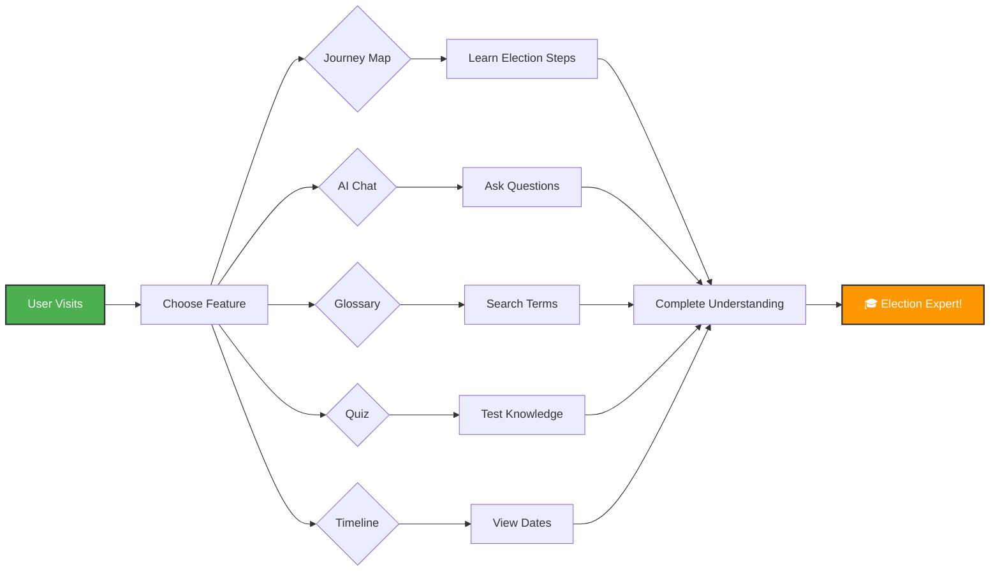
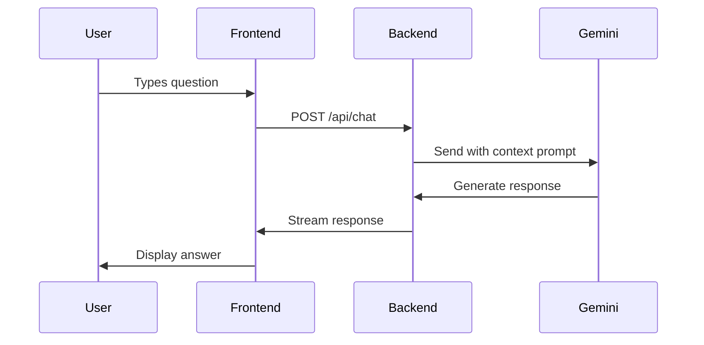

# 🗳️ Election Process Education Assistant

An interactive, gamified, and AI-powered web application that simplifies the election process through engaging visuals, quizzes, and multilingual support.

---

## 📋 Table of Contents
1. [Chosen Vertical](#-1-chosen-vertical)
2. [Approach and Logic](#-2-approach-and-logic)
3. [How the Solution Works](#-3-how-the-solution-works)
4. [Assumptions Made](#-4-assumptions-made)
5. [Setup Instructions](#-setup-instructions)

---

## 🎯 1. Chosen Vertical

**Election Process Education**

We focus on **civic education** by transforming complex electoral processes into an interactive, gamified learning experience. This addresses:
- Low civic awareness among citizens
- Boring traditional educational materials
- Need for multilingual, accessible platforms
- Preference for interactive digital learning

---

## 🧠 2. Approach and Logic

### Core Design Principles

🎮 **Gamified Learning**
- Premium glassmorphism UI with smooth animations
- Interactive components (expandable Journey Maps, responsive Quizzes)
- Visual feedback for user actions

📚 **Micro-Learning**
- Journey Map: Step-by-step election stages
- Timeline: Key dates visualization
- Glossary: Quick term reference
- Quiz: Knowledge validation

🤖 **AI-Powered Assistance**
- Google Gemini AI integration for instant Q&A
- Neutral, factual responses
- Context-aware answers

🌍 **Multilingual Support**
- 7 languages: English, Hindi, Marathi, Bengali, Tamil, Telugu, Gujarati
- Real-time translation via Google Gemini API

🔒 **Secure Architecture**
- Frontend: React with Vite
- Backend: Express.js API proxy
- API keys never exposed to client

---

## ⚙️ 3. How the Solution Works

### System Architecture

```mermaid
graph TB
    subgraph "Frontend (React + Vite)"
        A[User Interface]
        B[Journey Map]
        C[AI Chat]
        D[Glossary]
        E[Quiz]
        F[Timeline]
        G[Language Switcher]
    end
    
    subgraph "Backend (Node.js + Express)"
        H[API Server]
        I[/api/chat Endpoint]
        J[Translation Service]
    end
    
    subgraph "External Services"
        K[Google Gemini AI]
        L[Google Charts]
    end
    
    A --> B & C & D & E & F & G
    C --> I --> K
    G --> J --> K
    F --> L
    
    style A fill:#4CAF50,stroke:#333,stroke-width:2px,color:#fff
    style H fill:#2196F3,stroke:#333,stroke-width:2px,color:#fff
    style K fill:#FF9800,stroke:#333,stroke-width:2px,color:#fff
```

### Learning Flow



### Key Features

| Feature | Description | Technology |
|---------|-------------|------------|
| 🗺️ **Journey Map** | Interactive 5-stage election process (Registration → Campaigning → Voting → Counting → Results) | React Components |
| 🤖 **AI Chat** | Ask any election question, get instant AI-powered answers | Google Gemini API |
| 📚 **Glossary** | Searchable database of election terms with definitions | React State + Search |
| 🎮 **Quiz** | 5 MCQs with instant feedback (green/red highlights) and scoring | React Quiz Logic |
| 📅 **Timeline** | Visual representation of election dates | Google Charts |
| 🌍 **Translation** | Switch between 7 Indian languages instantly | Gemini Translation API |

### AI Chat Flow



---

## 📝 4. Assumptions Made

### Target Audience
- Users have basic digital literacy
- Users lack in-depth electoral knowledge but are interested in learning
- Users have internet-connected devices (desktop/tablet/mobile)

### Content & Data
- Focuses on general democratic election processes
- Timeline uses placeholder dates (production would use real election commission APIs)
- AI provides neutral, factual information applicable to democratic elections

### Technical Requirements
- Active internet connection for Google Gemini API
- Modern web browsers (Chrome, Firefox, Safari, Edge)
- Valid Google Gemini API key configured in backend

### Language & Translation
- Translation quality depends on Google Gemini API capabilities
- English is the default fallback language
- Some technical terms may not have direct translations

### Security & Privacy
- No user data is stored or tracked
- API keys stored securely in environment variables
- HTTPS communication in production

---

## 🛠️ Technology Stack

**Frontend**: React 18, Vite, CSS Modules, Lucide Icons, Google Charts  
**Backend**: Node.js, Express.js, CORS, dotenv  
**AI & Services**: Google Gemini API (Chat + Translation), Google Charts, Google Fonts

---

## 🚀 Setup Instructions

### Prerequisites
- Node.js installed ([Download](https://nodejs.org/))
- Google Gemini API Key ([Get Free Key](https://makersuite.google.com/app/apikey))

### Backend Setup

```bash
cd backend
npm install
```

Create `.env` file:
```env
PORT=5000
GEMINI_API_KEY=your_actual_api_key_here
```

Start server:
```bash
node server.js
```

### Frontend Setup

```bash
cd frontend
npm install
npm run dev
```

Open browser: `http://localhost:5173`

---

## 📖 Quick Start Guide

1. **Journey Map** - Click each election stage to learn
2. **AI Chat** - Ask questions like "What is EVM?" or "How to register to vote?"
3. **Glossary** - Search election terms
4. **Quiz** - Test your knowledge (5 questions)
5. **Timeline** - View important election dates
6. **Language** - Switch to your preferred language

---

## 🌍 Supported Languages

🇬🇧 English | 🇮🇳 हिंदी | 🇮🇳 मराठी | 🇮🇳 বাংলা | 🇮🇳 தமிழ் | 🇮🇳 తెలుగు | 🇮🇳 ગુજરાતી

---

## ❓ Troubleshooting

| Problem | Solution |
|---------|----------|
| Backend won't start | Check Node.js installed, port 5000 available, correct API key in `.env` |
| Frontend won't load | Ensure backend is running, use `http://localhost:5173`, clear browser cache |
| AI chat not working | Verify API key, check internet connection, ensure backend is running |
| Translation not working | Check backend is running, verify API key permissions |

---

## 👨‍💻 Developer

Created with ❤️ by **sarang-sketch**

---

## 🙏 Acknowledgments

**Google Gemini AI** • **Google Charts** • **React Community** • **Open Source Contributors**

---

**Happy Learning! 🎓**
