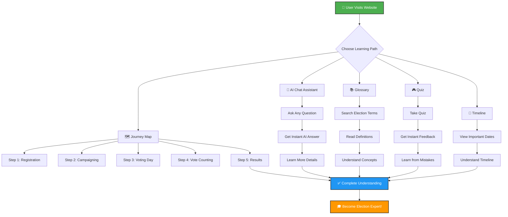
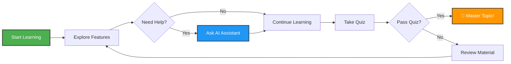
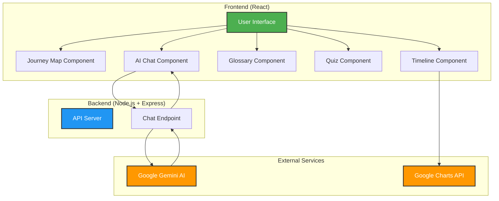

# 🗳️ Election Process Education Assistant

Learn about elections in a fun and interactive way! This web app makes understanding the election process easy with games, quizzes, AI chat, and beautiful visuals.

---

## 🎯 What is This?

This is an **interactive learning platform** that teaches you everything about elections - from voter registration to counting votes. Think of it as your personal election guide that makes learning fun!

---

## 📊 How Our Website Helps You Learn



### 🔄 Learning Flow



### 🏗️ System Architecture



---

## ✨ Features

### 🗺️ **Journey Map**
Follow the election process step-by-step with an interactive visual guide. Click on each stage to learn more about:
- Voter Registration
- Campaigning
- Voting Day
- Vote Counting
- Results & Inauguration

### 🤖 **AI Chat Assistant**
Ask any question about elections! Our smart AI assistant (powered by Google Gemini) will answer your questions instantly. Try asking:
- "How do I register to vote?"
- "What is an EVM?"
- "When are elections held?"

### 📚 **Glossary**
Search and learn election terms easily. Find definitions for words like:
- Ballot
- Constituency
- Electoral Roll
- And many more!

### 🎮 **Quiz**
Test your knowledge with fun quizzes! Get instant feedback with:
- ✅ Green highlights for correct answers
- ❌ Red highlights for wrong answers
- Detailed explanations for every question

### 📅 **Timeline View**
See important election dates on a beautiful visual timeline powered by Google Charts.

---

## 🎨 Why You'll Love It

- **Beautiful Design**: Modern, colorful interface that's easy on the eyes
- **Easy to Use**: Simple navigation - anyone can use it!
- **Learn at Your Pace**: Take your time, explore different sections
- **Interactive**: Click, explore, and learn by doing
- **Multilingual Support**: Available in multiple Indian languages (Hindi, Marathi, Bengali, Tamil, Telugu, Gujarati)
- **Safe & Secure**: Your data is protected

---

## 🛠️ Technology Used

- **Frontend**: React (modern web framework)
- **Backend**: Node.js with Express
- **AI**: Google Gemini API (for smart chat)
- **Charts**: Google Charts (for timeline)
- **Design**: Beautiful fonts from Google Fonts

## ---

## 🚀 How to Run This App

### Prerequisites (What You Need First)
- **Node.js** installed on your computer ([Download here](https://nodejs.org/))
- **Google Gemini API Key** ([Get it free here](https://makersuite.google.com/app/apikey))
- A web browser (Chrome, Firefox, Edge, etc.)

---

### Step 1: Setup the Backend (Server)

The backend is the "brain" that connects to Google's AI.

1. **Open your terminal/command prompt**

2. **Go to the backend folder:**
   ```bash
   cd backend
   ```

3. **Install required packages:**
   ```bash
   npm install
   ```

4. **Create a `.env` file** in the `backend` folder with this content:
   ```env
   PORT=5000
   GEMINI_API_KEY=your_actual_api_key_here
   ```
   ⚠️ **Important**: Replace `your_actual_api_key_here` with your real Google Gemini API key!

5. **Start the server:**
   ```bash
   node server.js
   ```
   
   ✅ You should see: `Server running on port 5000`

---

### Step 2: Setup the Frontend (Website)

The frontend is what you see and interact with.

1. **Open a NEW terminal/command prompt** (keep the backend running!)

2. **Go to the frontend folder:**
   ```bash
   cd frontend
   ```

3. **Install required packages:**
   ```bash
   npm install
   ```

4. **Start the website:**
   ```bash
   npm run dev
   ```

5. **Open your browser** and go to:
   ```
   http://localhost:5173
   ```

🎉 **That's it! The app should now be running!**

---

## 📖 How to Use

1. **Explore the Journey Map** - Click on each election stage to learn more
2. **Ask the AI** - Type any election question in the chat box
3. **Search the Glossary** - Look up any election term you don't understand
4. **Take the Quiz** - Test what you've learned
5. **View the Timeline** - See when important election events happen

---

## 🌍 Language Support

Switch between languages easily:
- 🇮🇳 Hindi (हिंदी)
- 🇮🇳 Marathi (मराठी)
- 🇮🇳 Bengali (বাংলা)
- 🇮🇳 Tamil (தமிழ்)
- 🇮🇳 Telugu (తెలుగు)
- 🇮🇳 Gujarati (ગુજરાતી)
- 🇬🇧 English

---

## ❓ Troubleshooting

**Problem: Backend won't start**
- Make sure you have Node.js installed
- Check if port 5000 is already in use
- Verify your `.env` file has the correct API key

**Problem: Frontend won't load**
- Make sure the backend is running first
- Check if you're using the correct URL: `http://localhost:5173`
- Try clearing your browser cache

**Problem: AI chat not working**
- Verify your Google Gemini API key is correct
- Check your internet connection
- Make sure the backend server is running

---

## 👨‍💻 Developer

Created with ❤️ by **sarang-sketch**

---

## 📝 License

This project is open source and available for educational purposes.

---

## 🙏 Acknowledgments

- Google Gemini AI for powering the chat assistant
- Google Charts for beautiful timeline visualizations
- React community for amazing tools and libraries

---

**Happy Learning! 🎓**
