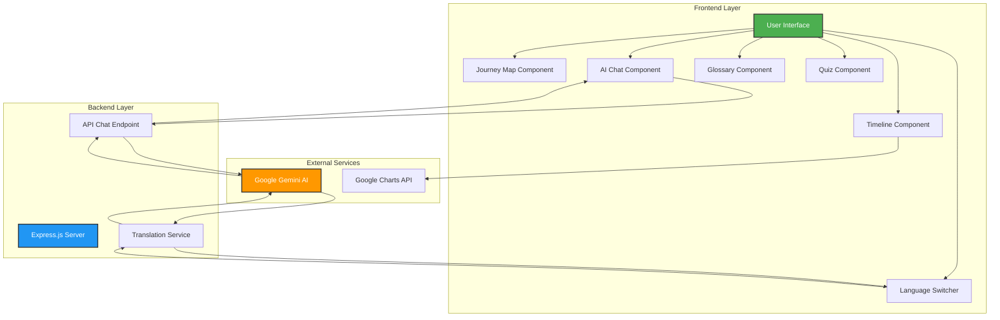
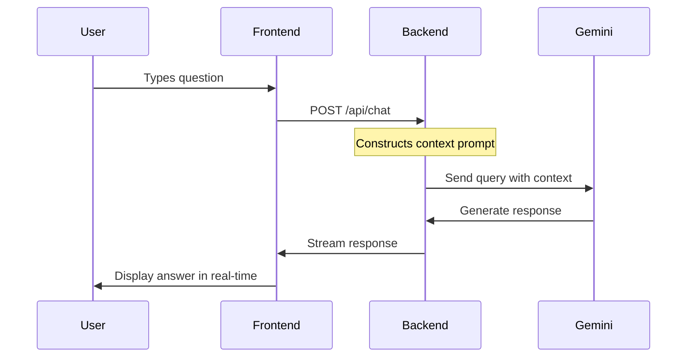

# 🗳️ Election Process Education Assistant

An interactive, gamified, and AI-powered web application that simplifies the election process through engaging visuals, quizzes, and multilingual support.

---

## 1. Your Chosen Vertical

**Election Process Education**

This project focuses on **civic education** by transforming complex electoral processes into an interactive, gamified learning experience.

### Why This Vertical?

- **Civic Awareness Gap**: Many citizens lack comprehensive understanding of election processes, leading to low voter participation and engagement
- **Boring Traditional Materials**: Existing educational content is often text-heavy, static, and fails to engage modern learners
- **Accessibility Barrier**: Need for multilingual, mobile-friendly platforms to reach diverse audiences across different regions
- **Digital Learning Preference**: Modern learners prefer interactive, gamified experiences over traditional textbook approaches

This vertical addresses a critical need in democratic societies by making election education accessible, engaging, and effective for all citizens.

---

## 2. Approach and Logic

Our solution is built on four core pillars:

### 🎮 Gamified Learning
- **Premium UI Design**: Glassmorphism theme with smooth animations and transitions
- **Interactive Components**: Expandable Journey Maps, clickable stages, responsive quizzes
- **Visual Feedback**: Instant color-coded responses (green for correct, red for incorrect)
- **Progress Tracking**: Quiz scoring system with performance feedback

### 📚 Micro-Learning Architecture
Information is broken into digestible modules:
- **Journey Map**: 5-stage visual progression (Registration → Campaigning → Voting → Counting → Results)
- **Timeline View**: Key dates and milestones visualization
- **Glossary**: Quick-reference searchable database of election terms
- **Quiz System**: Self-assessment with instant feedback and explanations

### 🤖 AI-Powered Assistance
- **Google Gemini Integration**: Real-time Q&A using `gemini-2.0-flash-exp` model
- **Context-Aware Responses**: AI understands election-specific queries
- **Neutral Information**: System prompts ensure factual, unbiased answers
- **Instant Availability**: 24/7 assistance for any election-related question

### 🌍 Multilingual Support
- **7 Languages**: English, Hindi, Marathi, Bengali, Tamil, Telugu, Gujarati
- **Dynamic Translation**: Real-time content translation via Google Gemini API
- **Complete Coverage**: All UI elements, quiz questions, glossary terms translated
- **Easy Switching**: One-click language toggle

### 🔒 Secure Architecture
```
Frontend (React + Vite) ←→ Backend (Express.js) ←→ Google Gemini API
```
- **Separation of Concerns**: Frontend handles UI, backend manages API communication
- **API Key Security**: Keys stored in environment variables, never exposed to client
- **CORS Protection**: Configured for secure cross-origin requests

---

## 3. How the Solution Works

### System Architecture



### Component Breakdown

#### 🗺️ Interactive Journey Map
**Purpose**: Guide users through the complete election process step-by-step

**How it works**:
1. User sees 5 main stages displayed as interactive cards
2. Clicking a stage expands it to show detailed information
3. Each stage includes: description, key activities, important points
4. Smooth animations enhance user experience

**Technical Implementation**:
- React state management for expand/collapse functionality
- CSS transitions for smooth animations
- Responsive design adapts to mobile/desktop

#### 🤖 AI Chat Assistant
**Purpose**: Provide instant answers to any election-related question

**Flow**:


**Technical Details**:
- Frontend: React component with input field and message display
- Backend: Express.js endpoint at `/api/chat`
- Context Prompt: Instructs AI to act as neutral Election Education Assistant
- Streaming: Real-time response display for better UX

#### 📚 Glossary
**Purpose**: Quick reference for election terminology

**Features**:
- **Search Functionality**: Real-time filtering as user types
- **Category Filtering**: Filter by term categories
- **Multilingual**: All terms dynamically translated
- **Comprehensive**: Covers key terms (Ballot, EVM, Constituency, Electoral Roll, NOTA, etc.)

**Technical Implementation**:
- JSON data structure for terms and definitions
- React state for search and filter logic
- Dynamic translation via Gemini API when language changes

#### 🎮 Quiz System
**Purpose**: Test and reinforce user knowledge

**Features**:
- **5 Multiple Choice Questions** covering all election stages
- **Instant Visual Feedback**: 
  - Correct answer: Green glow effect
  - Incorrect answer: Red glow effect
- **Detailed Explanations**: Learn why each answer is correct/incorrect
- **Score Tracking**: Final score with performance grading
- **Grading System**: 
  - 5/5: Excellent! 🎉
  - 4/5: Good Job! 👍
  - 3/5: Fair 👌
  - <3: Needs Improvement 📚

**Technical Implementation**:
- React state management for quiz logic
- Dynamic styling based on answer correctness
- Score calculation and feedback generation

#### 📅 Timeline View
**Purpose**: Visualize important election dates and milestones

**Features**:
- Interactive timeline powered by Google Charts
- Hover to see event details
- Color-coded events for different types
- Responsive design

#### 🌐 Translation System
**Purpose**: Make content accessible in multiple Indian languages

**How it works**:
1. User selects language from dropdown
2. Frontend sends translation request to backend
3. Backend calls Google Gemini API with content and target language
4. Translated content returned and displayed
5. All components (Journey Map, Quiz, Glossary) update simultaneously

**Coverage**:
- UI labels and buttons
- Journey Map content
- Quiz questions and answers
- Glossary terms and definitions
- Chat interface

---

## 4. Assumptions Made

### Target Audience Assumptions
- **Digital Literacy**: Users have basic ability to navigate web applications (click, scroll, type)
- **Learning Intent**: Users are genuinely interested in understanding election processes
- **Device Access**: Users have internet-connected devices (desktop, tablet, or smartphone)
- **Age Group**: Primarily targeting young adults and first-time voters (18-35 years)

### Content and Scope Assumptions
- **Democratic Focus**: Content applies to general democratic election processes
- **Country-Neutral**: While examples may be India-specific, principles are universal
- **Educational Purpose**: Content is for learning, not for political campaigning
- **Simplified Information**: Complex legal details are simplified for general understanding

### Data and Timeline Assumptions
- **Placeholder Dates**: Timeline uses fictional election dates for demonstration
- **Production Requirement**: Real deployment would integrate with official election commission APIs
- **Static Quiz**: Quiz questions are pre-defined (not dynamically generated)
- **Curated Glossary**: Terms are manually selected and defined

### Technical Assumptions
- **Internet Connectivity**: Active internet connection required for AI features
- **Modern Browsers**: Users have updated browsers (Chrome, Firefox, Safari, Edge)
- **API Availability**: Google Gemini API is accessible and responsive
- **API Key**: Valid Google Gemini API key is configured in backend environment

### Language and Translation Assumptions
- **Translation Quality**: Depends on Google Gemini API's language capabilities
- **Technical Terms**: Some election terms may not have direct translations in all languages
- **English Fallback**: English is the default language if translation fails
- **Context Preservation**: Translations maintain original meaning and context

### Security and Privacy Assumptions
- **No User Tracking**: Application doesn't store or track user data
- **Session-Based**: No user accounts or persistent data storage
- **API Key Security**: Backend environment variables are properly secured
- **HTTPS in Production**: Production deployment uses secure HTTPS protocol

### Performance Assumptions
- **API Response Time**: Google Gemini API responds within 2-5 seconds
- **Concurrent Users**: Application can handle moderate concurrent user load
- **Caching**: Browser caching is enabled for static assets
- **Network Speed**: Users have reasonable internet speeds (minimum 2G)

---

## 🛠️ Technology Stack

**Frontend**: React 18, Vite, CSS Modules, Lucide Icons, Google Charts  
**Backend**: Node.js, Express.js, CORS, dotenv  
**AI & Services**: Google Gemini API (Chat + Translation), Google Charts, Google Fonts

---

## 🚀 Setup Instructions

### Prerequisites
- Node.js installed ([Download](https://nodejs.org/))
- Google Gemini API Key ([Get Free Key](https://makersuite.google.com/app/apikey))

### Backend Setup

```bash
cd backend
npm install
```

Create `.env` file in `backend` folder:
```env
PORT=5000
GEMINI_API_KEY=your_actual_api_key_here
```

Start server:
```bash
node server.js
```

✅ You should see: `Server running on port 5000`

### Frontend Setup

Open a new terminal:

```bash
cd frontend
npm install
npm run dev
```

✅ Open browser: `http://localhost:5173`

---

## 🚀 Deploying to Vercel

### Step 1: Push to GitHub
Make sure your code is pushed to a GitHub repository.

### Step 2: Import Project to Vercel
1. Go to [Vercel Dashboard](https://vercel.com/dashboard)
2. Click "Add New" → "Project"
3. Import your GitHub repository
4. Vercel will auto-detect the configuration from `vercel.json`

### Step 3: Add Environment Variables
**CRITICAL**: Add your Google Gemini API key as an environment variable:

1. In Vercel project settings, go to **"Settings"** → **"Environment Variables"**
2. Add the following variable:
   - **Name**: `GEMINI_API_KEY`
   - **Value**: Your actual Google Gemini API key
   - **Environment**: Select all (Production, Preview, Development)
3. Click **"Save"**

### Step 4: Redeploy
After adding the environment variable:
1. Go to **"Deployments"** tab
2. Click the three dots on the latest deployment
3. Select **"Redeploy"**

✅ Your app should now be live with working AI chat!

### Vercel Deployment URLs
- **Frontend**: `https://your-app.vercel.app/`
- **Backend API**: `https://your-app.vercel.app/_/backend/api/chat`

---

## 📖 Features Overview

| Feature | Description | Technology |
|---------|-------------|------------|
| 🗺️ **Journey Map** | Interactive 5-stage election process | React Components |
| 🤖 **AI Chat** | Instant answers to election questions | Google Gemini API |
| 📚 **Glossary** | Searchable election terms database | React State + Search |
| 🎮 **Quiz** | 5 MCQs with instant feedback | React Quiz Logic |
| 📅 **Timeline** | Visual election dates | Google Charts |
| 🌍 **Translation** | 7 Indian languages support | Gemini Translation API |

---

## 🌍 Supported Languages

🇬🇧 English | 🇮🇳 हिंदी (Hindi) | 🇮🇳 मराठी (Marathi) | 🇮🇳 বাংলা (Bengali) | 🇮🇳 தமிழ் (Tamil) | 🇮🇳 తెలుగు (Telugu) | 🇮🇳 ગુજરાતી (Gujarati)

---

## ❓ Troubleshooting

| Problem | Solution |
|---------|----------|
| Backend won't start (Local) | Check Node.js installed, port 5000 available, correct API key in `.env` |
| Frontend won't load (Local) | Ensure backend is running, use `http://localhost:5173`, clear browser cache |
| AI chat not working (Local) | Verify API key in `.env`, check internet connection, ensure backend is running |
| Translation not working (Local) | Check backend is running, verify API key permissions, check internet |
| **"Please add a real Gemini API key" on Vercel** | **Go to Vercel → Settings → Environment Variables → Add `GEMINI_API_KEY` → Redeploy** |
| AI not responding on Vercel | Check Vercel logs for errors, verify environment variable is set correctly |

---

## 👨‍💻 Developer

Created with ❤️ by **sarang-sketch**

---

## 🙏 Acknowledgments

**Google Gemini AI** • **Google Charts** • **React Community** • **Open Source Contributors**

---

**Happy Learning! 🎓**
