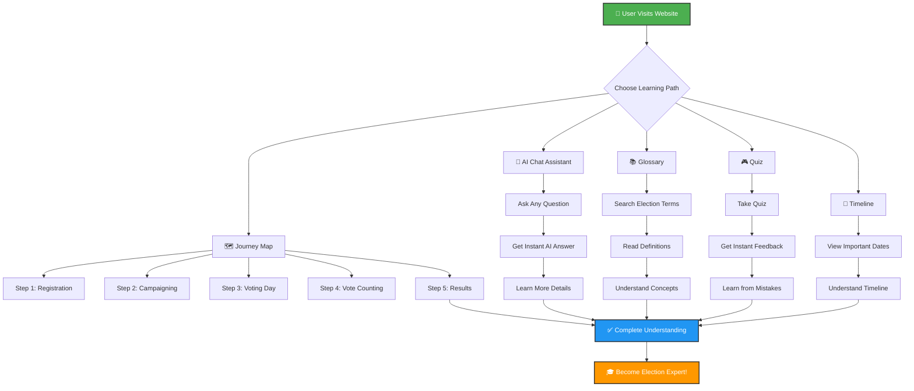
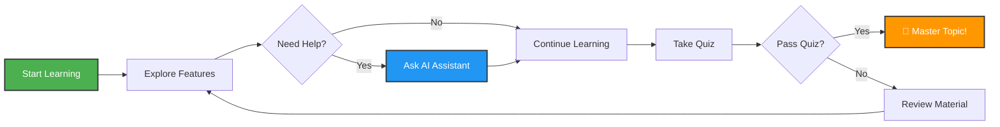
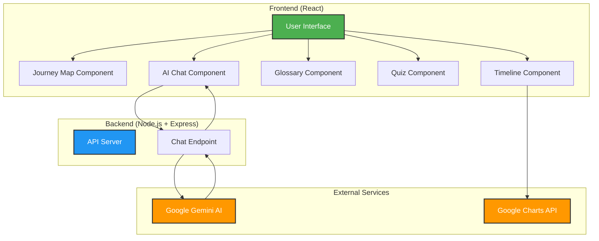
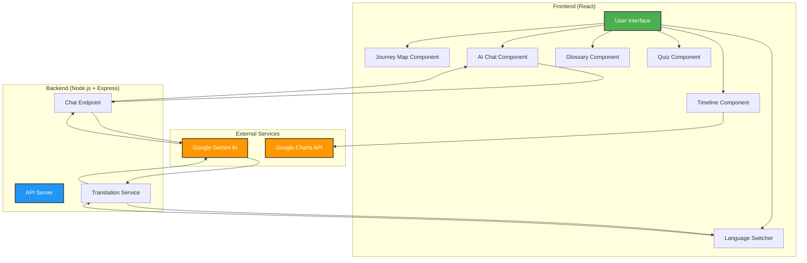

# 🗳️ Election Process Education Assistant

An interactive, gamified, and AI-powered web application designed to help users understand the election process, timelines, and steps in an easy-to-follow and engaging way.

---

## 📋 Table of Contents
1. [Chosen Vertical](#-1-chosen-vertical)
2. [Approach and Logic](#-2-approach-and-logic)
3. [How the Solution Works](#-3-how-the-solution-works)
4. [Assumptions Made](#-4-assumptions-made)
5. [Features](#-features)
6. [Technology Stack](#️-technology-stack)
7. [Setup Instructions](#-setup-instructions)
8. [Diagrams](#-system-diagrams)

---

## 🎯 1. Chosen Vertical

**Election Process Education**

This project focuses on **civic education** by simplifying the complex electoral process into an interactive, visually stunning, and gamified experience that encourages learning and participation. 

### Why This Vertical?
- **Civic Awareness**: Many citizens lack comprehensive understanding of election processes
- **Engagement Gap**: Traditional educational materials are often boring and hard to understand
- **Accessibility**: Need for multilingual, interactive platforms to reach diverse audiences
- **Digital Learning**: Modern learners prefer interactive, gamified experiences over static content

---

## 🧠 2. Approach and Logic

The application was built with the following core logic and design approach:

### 🎮 Gamified Learning
Instead of a static textbook approach, the UI uses a premium glassmorphism theme, dynamic animations, and interactive components (like expanding Journey Maps and responsive Quizzes) to maintain user engagement.

### 📚 Micro-Learning
Information is broken down into digestible pieces across different modules:
- **Step-by-step Journey Map**: Visual progression through election stages
- **Interactive Timeline**: Key dates and milestones
- **Searchable Glossary**: Quick reference for election terminology
- **Self-assessment Quiz**: Knowledge validation with instant feedback

### 🤖 AI-Powered Assistance
A Smart Q&A Assistant powered by Google Gemini AI is integrated into the dashboard, allowing users to ask contextual questions at any time during their learning journey. The AI provides:
- Instant, accurate answers to election-related queries
- Neutral, factual information without political bias
- Context-aware responses based on user questions

### 🔒 Secure Architecture
- **Frontend**: Handles the interactive UI and user experience
- **Backend**: Lightweight Express.js server securely proxies requests to Google Gemini API
- **Security**: API keys are never exposed to the client, ensuring secure communication

### 🌍 Multilingual Support
Dynamic translation powered by Google Gemini API supports 7 languages:
- English, Hindi, Marathi, Bengali, Tamil, Telugu, Gujarati
- Real-time translation of all content including quizzes, glossary, and journey map

---

## ⚙️ 3. How the Solution Works

### 🗺️ Interactive Election Journey Map
A step-by-step visual timeline of the election process with expanding details explaining:
1. **Voter Registration**: How to register, eligibility criteria, documents needed
2. **Campaigning**: Political party activities, rallies, manifestos
3. **Voting Day**: Polling booth procedures, EVM usage, voter rights
4. **Vote Counting**: Counting process, result declaration timeline
5. **Inauguration**: Swearing-in ceremony, government formation

**Technical Implementation**:
- React components with state management for expandable sections
- CSS animations for smooth transitions
- Responsive design for mobile and desktop

### 🤖 Smart Q&A Assistant (AI Chat)
An intelligent chatbot powered by **Google Gemini API (`gemini-2.0-flash-exp`)**:

**Flow**:
1. User types a question in the React frontend
2. Frontend sends the question to Node.js backend (`/api/chat` endpoint)
3. Backend constructs a specific context prompt instructing the AI to act as a neutral Election Education Assistant
4. Google Gemini API processes the query and generates a response
5. Response is streamed back to the user interface in real-time

**Features**:
- Context-aware responses
- Neutral and factual information
- Quick question suggestions
- Real-time streaming responses

### 📚 Election Glossary
A client-side searchable database of key election terms:
- **Terms Covered**: Ballot, EVM, Constituency, Electoral Roll, NOTA, Polling Booth, etc.
- **Search Functionality**: Real-time filtering as user types
- **Category Filtering**: Filter by term categories
- **Multilingual**: All terms translated dynamically

**Technical Implementation**:
- JSON data structure for terms and definitions
- React state for search and filter logic
- Dynamic translation via Gemini API

### 🎮 Knowledge Check (Quiz)
An interactive quiz component that tests user understanding:
- **5 Multiple Choice Questions** covering all election stages
- **Instant Visual Feedback**: Green glow for correct, red for incorrect answers
- **Detailed Explanations**: Learn why each answer is correct/incorrect
- **Score Tracking**: Final score with performance feedback
- **Grading System**: Excellent (5/5), Good (4/5), Fair (3/5), Needs Improvement (<3)

**Technical Implementation**:
- React state management for quiz logic
- Dynamic styling based on answer correctness
- Score calculation and feedback generation

### 📅 Timeline View
Visual representation of key election dates utilizing **Google Charts (`react-google-charts`)**:
- **Interactive Timeline**: Hover to see event details
- **Color-coded Events**: Different colors for different event types
- **Responsive Design**: Adapts to screen size

### 🌐 Multilingual Translation System
Dynamic translation powered by Google Gemini API:
- **Real-time Translation**: Content translated on-demand
- **Context Preservation**: Maintains meaning across languages
- **Component Coverage**: All UI elements, quiz questions, glossary terms translated
- **Language Switcher**: Easy toggle between 7 supported languages

---

## 📝 4. Assumptions Made

### Target Audience
- Users have basic digital literacy and can navigate web applications
- Users lack in-depth knowledge of electoral mechanics but are interested in learning
- Users have access to internet-connected devices (desktop, tablet, or mobile)

### Content Scope
- The application focuses on general democratic election processes applicable to most democracies
- Specific country-level variations may require additional customization
- The AI assistant is instructed to provide neutral, factual information applicable to democratic elections

### Data and Timeline
- Timeline data uses placeholder dates for a fictional election cycle
- In a production environment, this data would be fetched dynamically from an official election commission API or database
- Quiz questions and glossary terms are curated for educational purposes

### Technical Requirements
- Users have an active internet connection to communicate with Google Gemini API
- Modern web browsers (Chrome, Firefox, Safari, Edge) with JavaScript enabled
- Backend server has valid Google Gemini API key configured

### Language Support
- Translation quality depends on Google Gemini API's language capabilities
- Some technical election terms may not have direct translations in all languages
- English is the default fallback language

### Security and Privacy
- No user data is stored or tracked
- API keys are securely stored in environment variables
- All communication between frontend and backend is over HTTPS in production

---

## ✨ Features

### 🗺️ **Journey Map**
Follow the election process step-by-step with an interactive visual guide. Click on each stage to learn more about:
- Voter Registration
- Campaigning
- Voting Day
- Vote Counting
- Results & Inauguration

### 🤖 **AI Chat Assistant**
Ask any question about elections! Our smart AI assistant (powered by Google Gemini) will answer your questions instantly. Try asking:
- "How do I register to vote?"
- "What is an EVM?"
- "When are elections held?"

### 📚 **Glossary**
Search and learn election terms easily. Find definitions for words like:
- Ballot, Constituency, Electoral Roll, EVM, NOTA, and many more!

### 🎮 **Quiz**
Test your knowledge with fun quizzes! Get instant feedback with:
- ✅ Green highlights for correct answers
- ❌ Red highlights for wrong answers
- Detailed explanations for every question
- Score tracking and performance feedback

### 📅 **Timeline View**
See important election dates on a beautiful visual timeline powered by Google Charts.

### 🌍 **Multilingual Support**
Available in 7 languages: English, Hindi, Marathi, Bengali, Tamil, Telugu, Gujarati

---

## 🛠️ Technology Stack

### Frontend
- **React 18** with Vite for fast development
- **CSS Modules** for component styling
- **Lucide React** for beautiful icons
- **React Google Charts** for timeline visualization

### Backend
- **Node.js** with Express.js
- **CORS** for secure cross-origin requests
- **dotenv** for environment variable management

### Google Services Integrated
- **Google Generative AI SDK (Gemini API)**: Powers the conversational AI assistant and multilingual translation
- **Google Charts**: Powers the interactive Timeline visualization
- **Google Fonts (Plus Jakarta Sans & Playfair Display)**: Provides premium modern typography

### Architecture
```
Frontend (React) ←→ Backend (Express.js) ←→ Google Gemini API
                                        ↓
                                  Google Charts API
```

---

## 📊 How Our Website Helps You Learn



### 🔄 Learning Flow



### 🏗️ System Architecture



---

## ✨ Features

### 🗺️ **Journey Map**
Follow the election process step-by-step with an interactive visual guide. Click on each stage to learn more about:
- Voter Registration
- Campaigning
- Voting Day
- Vote Counting
- Results & Inauguration

### 🤖 **AI Chat Assistant**
Ask any question about elections! Our smart AI assistant (powered by Google Gemini) will answer your questions instantly. Try asking:
- "How do I register to vote?"
- "What is an EVM?"
- "When are elections held?"

### 📚 **Glossary**
Search and learn election terms easily. Find definitions for words like:
- Ballot
- Constituency
- Electoral Roll
- And many more!

### 🎮 **Quiz**
Test your knowledge with fun quizzes! Get instant feedback with:
- ✅ Green highlights for correct answers
- ❌ Red highlights for wrong answers
- Detailed explanations for every question

### 📅 **Timeline View**
See important election dates on a beautiful visual timeline powered by Google Charts.

---

## 🎨 Why You'll Love It

- **Beautiful Design**: Modern, colorful interface that's easy on the eyes
- **Easy to Use**: Simple navigation - anyone can use it!
- **Learn at Your Pace**: Take your time, explore different sections
- **Interactive**: Click, explore, and learn by doing
- **Multilingual Support**: Available in multiple Indian languages (Hindi, Marathi, Bengali, Tamil, Telugu, Gujarati)
- **Safe & Secure**: Your data is protected

---

## 🛠️ Technology Used

- **Frontend**: React (modern web framework)
- **Backend**: Node.js with Express
- **AI**: Google Gemini API (for smart chat)
- **Charts**: Google Charts (for timeline)
- **Design**: Beautiful fonts from Google Fonts

```

---

## 🚀 Setup Instructions

### Prerequisites (What You Need First)
- **Node.js** installed on your computer ([Download here](https://nodejs.org/))
- **Google Gemini API Key** ([Get it free here](https://makersuite.google.com/app/apikey))
- A web browser (Chrome, Firefox, Edge, etc.)

---

### Step 1: Setup the Backend (Server)

The backend is the "brain" that connects to Google's AI.

1. **Open your terminal/command prompt**

2. **Go to the backend folder:**
   ```bash
   cd backend
   ```

3. **Install required packages:**
   ```bash
   npm install
   ```

4. **Create a `.env` file** in the `backend` folder with this content:
   ```env
   PORT=5000
   GEMINI_API_KEY=your_actual_api_key_here
   ```
   ⚠️ **Important**: Replace `your_actual_api_key_here` with your real Google Gemini API key!

5. **Start the server:**
   ```bash
   node server.js
   ```
   
   ✅ You should see: `Server running on port 5000`

---

### Step 2: Setup the Frontend (Website)

The frontend is what you see and interact with.

1. **Open a NEW terminal/command prompt** (keep the backend running!)

2. **Go to the frontend folder:**
   ```bash
   cd frontend
   ```

3. **Install required packages:**
   ```bash
   npm install
   ```

4. **Start the website:**
   ```bash
   npm run dev
   ```

5. **Open your browser** and go to:
   ```
   http://localhost:5173
   ```

🎉 **That's it! The app should now be running!**

---

## 📊 System Diagrams


### 📊 How Our Website Helps You Learn


### 🔄 Learning Flow


### 🏗️ System Architecture



---

## 📖 How to Use

1. **Explore the Journey Map** - Click on each election stage to learn more
2. **Ask the AI** - Type any election question in the chat box
3. **Search the Glossary** - Look up any election term you don't understand
4. **Take the Quiz** - Test what you've learned
5. **View the Timeline** - See when important election events happen
6. **Switch Languages** - Use the language selector to view content in your preferred language

---

## 🌍 Language Support

Switch between languages easily:
- 🇮🇳 Hindi (हिंदी)
- 🇮🇳 Marathi (मराठी)
- 🇮🇳 Bengali (বাংলা)
- 🇮🇳 Tamil (தமிழ்)
- 🇮🇳 Telugu (తెలుగు)
- 🇮🇳 Gujarati (ગુજરાતી)
- 🇬🇧 English

---

## ❓ Troubleshooting

**Problem: Backend won't start**
- Make sure you have Node.js installed
- Check if port 5000 is already in use
- Verify your `.env` file has the correct API key

**Problem: Frontend won't load**
- Make sure the backend is running first
- Check if you're using the correct URL: `http://localhost:5173`
- Try clearing your browser cache

**Problem: AI chat not working**
- Verify your Google Gemini API key is correct
- Check your internet connection
- Make sure the backend server is running

**Problem: Translation not working**
- Ensure backend server is running
- Check API key has translation permissions
- Verify internet connection

---

## 👨‍💻 Developer

Created with ❤️ by **sarang-sketch**

---

## 📝 License

This project is open source and available for educational purposes.

---

## 🙏 Acknowledgments

- **Google Gemini AI** for powering the chat assistant and multilingual translation
- **Google Charts** for beautiful timeline visualizations
- **React Community** for amazing tools and libraries
- **Open Source Contributors** for various packages used in this project

---

## 🎯 Future Enhancements

- Integration with real-time election commission APIs
- User accounts and progress tracking
- More quiz questions and difficulty levels
- Video tutorials for each election stage
- Mobile app version
- Offline mode support
- Community discussion forums

---

**Happy Learning! 🎓**
